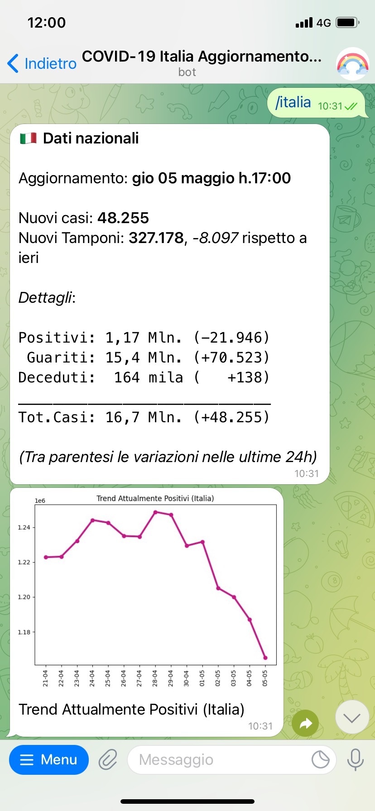

# covid-19: the Telegram bot for Italian data

**#tuttoandràbene** 🌈

A Telegram bot providing the updated data of the COVID-19 (novel coronavirus) outbreak in Italy.

This bot is currently operated by **[@covid19_dati_italia_bot](https://t.me/covid19_dati_italia_bot)** on Telegram

## Commands

[Available commands](app/commands.txt) (in Italian)

## Credits

* Data Source: [Protezione Civile: Dati COVID-19 Italia](https://github.com/pcm-dpc/COVID-19)
* Bot and repo rainbow icon designed by Freepik (https://www.flaticon.com/)
