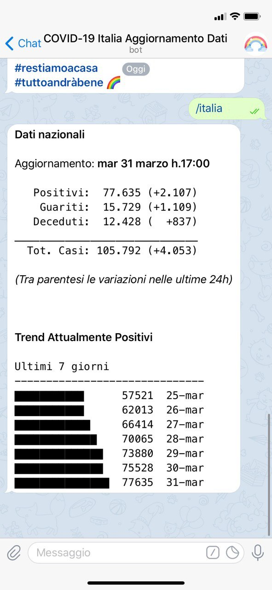

# covid-19: the Telegram bot for Italian data

**#restiamoacasa** **#tuttoandràbene** 🌈

A Telegram bot providing the updated data of the COVID-19 (novel coronavirus) outbreak in Italy.

This bot is currently operated by **[@covid19_dati_italia_bot](https://t.me/covid19_dati_italia_bot)** on Telegram

Further info coming soon...

## Commands

Available commands (in Italian):

* /italia - Dati aggregati a livello nazionale
* /regione - Dati per regione
* /provincia - Dati per provincia
* /positivi_regione - Attualmente positivi per ogni regione
* /nuovi_regione - Nuovi casi per ogni regione
* /nuovi_provincia - Nuovi casi per provincia
* /help - Istruzioni di utilizzo
* /legenda - Legenda per capire i dati
* /credits - Informazioni su questo bot

## Credits

* Data Source: [Protezione Civile: Dati COVID-19 Italia](https://github.com/pcm-dpc/COVID-19)
* Bot and repo rainbow icon designed by Freepik (https://www.flaticon.com/)
