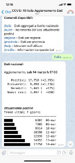

# covid-19: italian data bot

*#restiamoacasa* *#tuttoandràbene* 🌈

A Telegram bot providing the updated data of the COVID-19 (Coronavirus) outbreak in Italy.

This bot is currently operated by **@covid19_dati_italia_bot** on Telegram

Further info coming soon...

## Commands

Available commands (in Italian):

* /italia - Dati aggregati a livello nazionale
* /nuovi - Incremento dei casi attualmente positivi
* /regione - Dati per regione
* /provincia - Dati per provincia
* /help - Istruzioni sull’utilizzo
* /credits - Informazioni su questo bot

## Credits

* Data Source: [Protezione Civile: Dati COVID-19 Italia](https://github.com/pcm-dpc/COVID-19)
* Bot and repo rainbow icon designed by Freepik (https://www.flaticon.com/)
